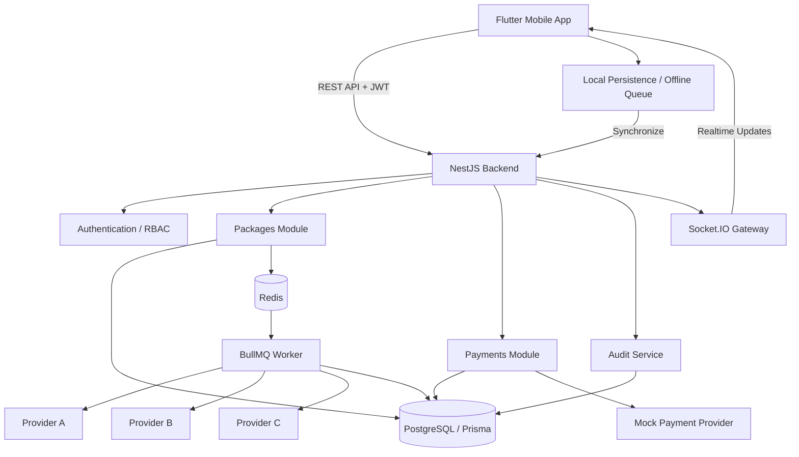
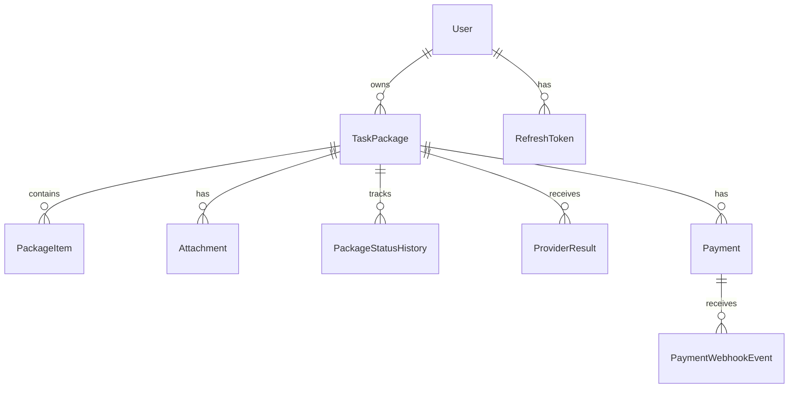

# VectorFlow

VectorFlow is a cross-platform task package processing system built with **Flutter** and **NestJS**.

The project demonstrates a production-oriented architecture covering mobile application development, offline-first workflows, asynchronous background processing, realtime updates, authentication and authorization, external-provider integration, payment workflows, concurrency protection, and audit logging.

---

## Project Structure

```text
VectorFlow/
├── backend/                 # NestJS backend
│   ├── src/
│   ├── prisma/
│   ├── .github/workflows/
│   ├── API.md
│   ├── README.md
│   ├── docker-compose.yml
│   ├── verify.ps1
│   └── verify.sh
│
└── flutter/                 # Flutter mobile application
    ├── lib/
    ├── android/
    ├── ios/
    ├── test/
    └── pubspec.yaml
```

---

## Technology Stack

### Mobile

- Flutter
- Dart
- Local persistence
- Offline operation queue
- Socket.IO realtime communication

### Backend

- NestJS
- TypeScript
- Prisma ORM
- PostgreSQL
- Redis
- BullMQ
- Socket.IO
- JWT authentication

### Infrastructure & Tooling

- Docker
- PostgreSQL 16
- Redis 7
- GitHub Actions
- Prisma migrations

---

## Core Features

### Authentication & Security

The backend implements:

- User registration and login
- JWT access tokens
- Refresh tokens
- Role-based access control
- `USER`, `REVIEWER`, and `ADMIN` roles
- Resource ownership validation
- IDOR protection
- DTO validation
- Helmet security headers
- Global API rate limiting

Package and payment resources are queried together with the authenticated user's identity to prevent unauthorized cross-user access.

---

## Task Package Management

Users can create task packages containing:

- Multiple items
- Priority
- Notes
- Geographic location
- Attachments

The package lifecycle follows:

```text
submitted
    ↓
processing
    ↓
waiting_for_external_result
    ↓
ready
    ↓
completed
```

Processing failures can transition the package to:

```text
failed
```

---

## Asynchronous Processing

Package processing is handled asynchronously using:

```text
NestJS API
    ↓
Redis
    ↓
BullMQ
    ↓
Background Worker
    ↓
External Providers
    ↓
PostgreSQL
```

The client does not need to wait for long-running provider processing to finish before the original API request can complete.

BullMQ retry and backoff behavior is used for recoverable processing failures.

Deterministic job identifiers and database-level package claiming help prevent duplicate processing.

---

## External Provider Integration

The backend contains mock external providers representing different third-party API behaviors.

### Provider A

Demonstrates normalization of a nested external response.

### Provider B

Demonstrates:

- External failure/timeout simulation
- Retry behavior
- Recovery on a subsequent attempt

### Provider C

Demonstrates:

- Multiple external results
- Duplicate-result normalization

The different provider contracts are transformed into a common internal representation before persistence.

---

## Realtime Status Updates

VectorFlow uses **Socket.IO** for realtime communication between the NestJS backend and Flutter client.

Authenticated clients can receive package status transitions such as:

```text
processing
→ waiting_for_external_result
→ ready
→ completed
```

This avoids requiring the mobile client to continuously poll the backend for package status.

---

## Offline-First Mobile Workflow

The Flutter application contains local persistence and synchronization logic for supported offline operations.

When connectivity is unavailable, supported operations can be retained locally and synchronized when connectivity returns.

Idempotency controls on the backend protect retryable operations from creating duplicate business records.

This is particularly important for unstable mobile-network conditions where the client may not know whether a previous request reached the server.

---

## Idempotency

Idempotency is implemented for important retryable workflows.

Examples include:

- Task package creation using `clientId`
- Attachment upload using an idempotency key
- Payment intent creation using `Idempotency-Key`
- Payment webhook deduplication using provider event IDs

Repeated requests therefore do not automatically result in duplicate business operations.

---

## Payments

VectorFlow includes a **mock payment workflow** for demonstrating payment architecture without handling real card information.

Implemented flows include:

- Payment intent creation
- Idempotent payment requests
- Payment confirmation
- Successful payment
- Failed payment
- Webhook processing
- Duplicate webhook protection
- Refund processing

Example lifecycle:

```text
REQUIRES_CONFIRMATION
        ↓
    PROCESSING
     ↙      ↘
SUCCEEDED   FAILED
    ↓
 REFUNDED
```

No real card data or production payment provider credentials are used.

---

## Concurrency Protection

The processing architecture includes protection against multiple workers attempting to process the same package.

A package can be claimed for processing so that another worker encountering the same work does not repeat the same business operation.

This complements BullMQ's deterministic job identifiers with database-backed protection.

---

## Audit Trail

Important business operations can be recorded in the `AuditLog` table.

Audit information includes:

- Actor
- Action
- Entity
- Entity ID
- Previous value
- New value
- Context
- Timestamp

Example:

```text
PACKAGE_CREATED
TaskPackage
<package-id>
<authenticated-user-id>
Package created by authenticated user
<timestamp>
```

Sensitive credentials and authentication tokens should not be written to audit records.

---

## Database Design

PostgreSQL is used as the primary database through Prisma ORM.

Main entities include:

- `User`
- `RefreshToken`
- `TaskPackage`
- `PackageItem`
- `Attachment`
- `PackageStatusHistory`
- `ProviderResult`
- `Payment`
- `PaymentWebhookEvent`
- `AuditLog`

Prisma migrations are maintained under:

```text
backend/prisma/migrations/
```

---

## High-Level Architecture



---

## Database Relationships



---

# Running the Project

## Requirements

Install:

- Node.js
- npm
- Docker Desktop
- Flutter SDK

---

## Backend Setup

Navigate to:

```bash
cd backend
```

Install dependencies:

```bash
npm install
```

Create a local `.env` file based on:

```text
.env.example
```

Do not commit the real `.env` file.

Start PostgreSQL and Redis:

```bash
docker compose up -d
```

Check containers:

```bash
docker ps
```

Generate Prisma Client:

```bash
npx prisma generate
```

Apply database migrations:

```bash
npx prisma migrate deploy
```

Start the backend:

```bash
npm run start:dev
```

The API runs at:

```text
http://localhost:3000/api
```

---

## Flutter Setup

Navigate to:

```bash
cd flutter
```

Install packages:

```bash
flutter pub get
```

Check the Flutter environment:

```bash
flutter doctor
```

Analyze the project:

```bash
flutter analyze
```

Run the application:

```bash
flutter run
```

Build an Android debug APK:

```bash
flutter build apk --debug
```

For a physical Android device, configure the backend host so that the phone can reach the development machine over the local network.

---

## Backend Verification

A Windows verification script is included:

```powershell
cd backend
powershell -ExecutionPolicy Bypass -File ./verify.ps1
```

Linux/macOS:

```bash
chmod +x verify.sh
./verify.sh
```

Verification includes checks for:

- Docker containers
- PostgreSQL readiness
- Prisma migrations
- Prisma schema validation
- Prisma Client generation
- Backend compilation
- Authentication protection
- Dependency audit

---

## Build Verification

Backend:

```bash
npm run build
```

Flutter:

```bash
flutter analyze
flutter build apk --debug
```

---

## API Documentation

Additional backend/API documentation is available at:

```text
backend/API.md
backend/README.md
```

---

## Continuous Integration

GitHub Actions workflow configuration is included under:

```text
backend/.github/workflows/
```

The CI configuration provides automated verification of the project when used in a GitHub workflow environment.

---

## Environment & Secrets

Production secrets are intentionally excluded from source control.

Use:

```text
backend/.env.example
```

as the environment configuration template.

Never commit:

```text
.env
```

or production credentials.

---

## Known Limitations / Production Considerations

This project is an assessment implementation demonstrating the architecture and major reliability patterns.

Before a production deployment, the following areas should be extended:

- Replace mock external providers with production integrations.
- Replace mock payments with a PCI-compliant payment provider.
- Restrict CORS to approved production origins.
- Move uploaded files to managed object storage.
- Perform controlled dependency/security upgrades.
- Expand automated integration and end-to-end test coverage.
- Add production-grade monitoring, tracing, metrics, and alerting.
- Store production secrets in a dedicated secret-management system.
- Expand resumable large-file upload capabilities where required.
- Expand offline edit conflict-resolution strategies for multi-device scenarios.
- Complete platform-specific validation across both Android and iOS environments.

---

## Dependency Security Note

Dependency auditing may report vulnerabilities in transitive dependencies.

Some available automatic fixes require major/breaking dependency upgrades. These should be performed as controlled upgrades followed by regression and security testing rather than force-applied immediately to a verified build.

---

## Design Goals

VectorFlow was designed around the following engineering principles:

1. **Reliability** — network failures and retries should not automatically create duplicate operations.
2. **Security** — authenticated users must only access resources they are authorized to access.
3. **Responsiveness** — long-running work should execute asynchronously.
4. **Offline tolerance** — supported mobile operations should tolerate unstable connectivity.
5. **Traceability** — important business operations should be auditable.
6. **Extensibility** — external providers should be normalized behind consistent internal models.
7. **Realtime UX** — users should receive status changes without continuous polling.

---

## Disclaimer

External-provider and payment integrations in this repository are mock implementations created for demonstration and assessment purposes.

No real payment card information, production payment credentials, or production third-party credentials are included in the repository.
